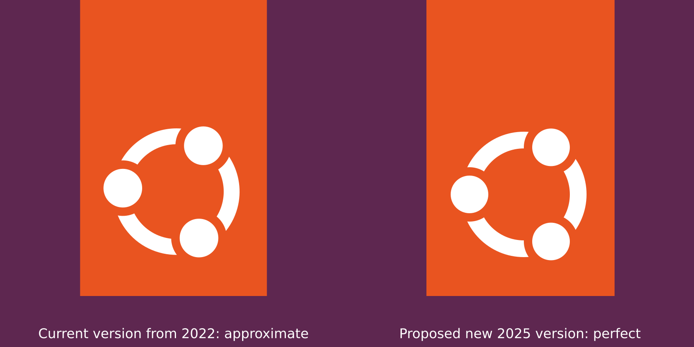
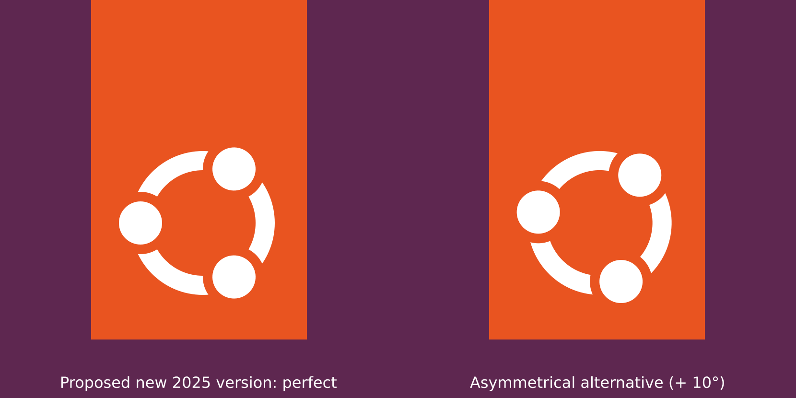

> Ubuntu means "a humanist and ethic philosophy concentrating on the relations and allegiances of the people with each other". The Ubuntu logo can be described as the graphical illustration of three people holding their arms out and making a circle.

<br>

## The Ubuntu Logo Redone with absolute precision

Your logo has a good concept and looks good. But it looks subtly imperfect, to me. At first glance, the three heads are placed at very right, symmetrical angles: 30°, 150°, 270°. But, when you look more closely, there is a very subtle additional rotation. A rotation so subtle that it seems more accidental than intentional to me.


In comparison, the previous version from 2010 was made of perfect values everywhere. The 3 circles, or heads, had perfectly symmetrical rotation angles of 30°, 150°, and 270° degrees.

Don't get me wrong: I like your new logo version from 2022, as I like the entire graphic design of the system. So I am not suggesting any major change to the concept of the logo, but just a redrawn version of the same logo. Just a few pixels of difference.

<br>

## The Canonical/Ubuntu logo version 2025



I created many versions but the core version is [logo-v2025-plain-450x708.svg](logo-v2025-plain-450x708.svg). You can check the code: it is pretty pure.

Okay, it's just a logo. But this logo is the first thing I see when I start my computer. A well-designed logo will inspire all my work. Here are some excerpts from [Our brand values](https://design.ubuntu.com/brand) :

> Ubuntu is crisp and clean in engineering and attitude. There is beauty in the precision of the process and product.

> Our values should be evident wherever Ubuntu is encountered, whether online or via traditional marketing material.

> The Ubuntu logo is striking and clear, and it represents the brand’s core values.

<br>

## Alternate "Organic" Version



Else, if you really wanted the logo to look less formal, less symmetrical, then I would suggest adding an obvious rotation, let's say 10 degrees for example. Otherwise, it just looks like a mistake to me.

<br>

## Update Your Local Files

**First**, [Download](https://github.com/SebastJava/Ubuntu-logo/archive/refs/heads/main.zip) this repository as a ZIP file and extract it.

**Next**, open your terminal into this directory. Example:

```
cd ~/Downloads/Ubuntu-logo-main
```

**Replace the "Show Apps" icon:**

```
sudo cp Do-It-Yourself/start-here-symbolic.svg /usr/share/icons/Yaru/scalable/places/start-here-symbolic.svg
```

NOTE: If you are using [Dash-to-Panel](https://extensions.gnome.org/extension/1160/dash-to-panel/) you can easily choose your start icon from there. You can use the standard `start-here-symbolic.svg` or one of the variants in the `start-here-variants` directory.

**Boot sequence and login screen:**

```
sudo cp Do-It-Yourself/ubuntu-logo-v2025-plymouth.png /usr/share/plymouth/themes/spinner/watermark.png
sudo cp Do-It-Yourself/ubuntu-logo-v2025-plymouth.png /usr/share/plymouth/ubuntu-logo.png
```

You must update your initramfs after having changed this Plymouth theme:

```
sudo update-initramfs -u
```

WARNING: Please disable your Kernel Livepatch to avoid some weird Plymouth on first restart... (Go to Software & Updates > Ubuntu Pro)

RESTART your computer to see your updated logos on the boot sequence, login screen and dash.


