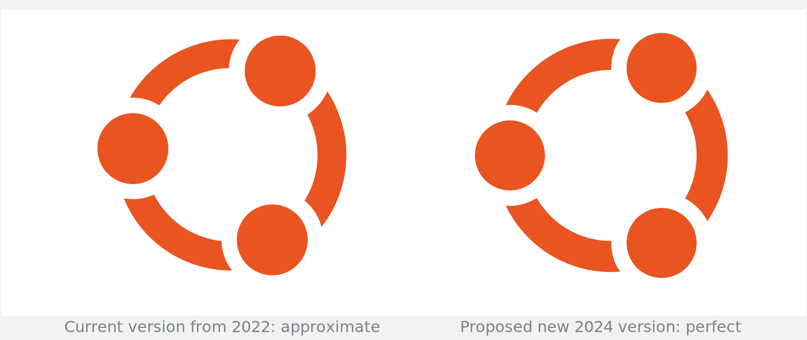
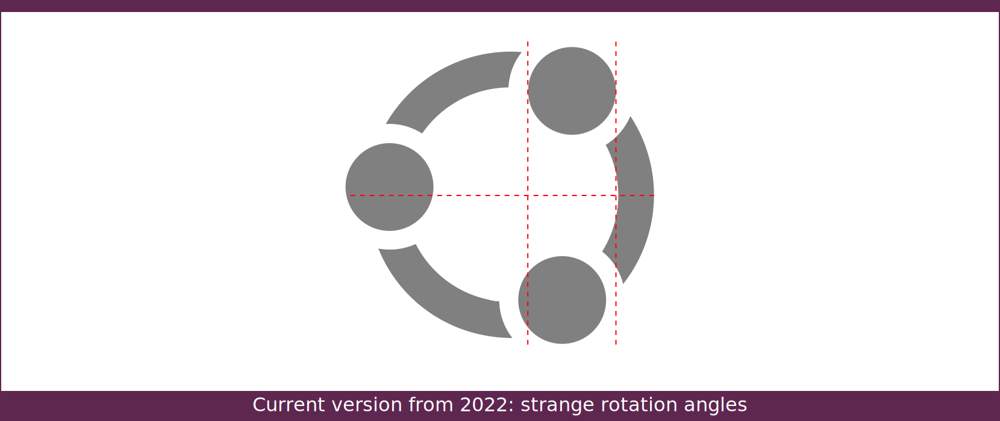

## The Ubuntu logo redone in a more precise way

There is no innovation here. It is still the same logo, with just a few pixels difference.

> Ubuntu means "a humanist and ethic philosophy concentrating on the relations and allegiances of the people with each other". The Ubuntu logo can be described as the graphical illustration of three people holding their arms out and making a circle.

The 2022 version of the logo is excellent, it is a good concept that does not need to be explained. But its execution is not perfect. A keen eye sees subtle approximations, and that is disturbing.



The current version of the Ubuntu logo, this 2022 version, has undergone a subtle, almost invisible rotation, and it looks like a mistake or an imperfection, IMHO. In comparison, the previous version from 2010 was made of perfect values everywhere. The 3 circles, or heads, had perfectly symmetrical rotation angles of   30°, 150°, and 270° degrees. And they also had perfectly identical diameters. But that's not the case here with this current version from 2022. The diameters are approximate, and the rotation angles are weird. It feels like a mistake. Those angles are roughly set at something like 32.75°, 152.75°, 272.75°...


If you wanted the logo to look less formal, less symmetrical, then I would suggest adding an obvious rotation, say 15 degrees. Otherwise, it just looks like a mistake to me.

Don't get me wrong, I think your logo is pretty good as is. It isn't ugly at all and it clearly carries some significance, some positive values. I don't want to change anything to this concept. I don't even want this assymetrical alternative showed here. I just want to push this standard 2024 version as showed here on top of this page. That's the same logo as the current one, but redone in a perfectly precise way.

>  The logo is the most recognisable feature of any brand identity. The
>  Ubuntu logo is striking and clear, and it represents the brand’s core
>  values. — https://design.ubuntu.com/brand

A more precisely executed logo would set the tone for the rest of the distribution...

### URL resources

version 2022: https://design.ubuntu.com/resources (current version)  

version 2010: https://en.m.wikipedia.org/wiki/File:UbuntuCoF.svg  

### Update your local files

**First**, [Download](https://github.com/SebastJava/Ubuntu-logo/archive/refs/heads/main.zip) and extract this ZIP directory.

**Next**, open your terminal into this directory. Example:

```
cd ~/Downloads/Ubuntu-logo-main
```

**Replace the "Show Apps" icon:**

```
sudo cp start-here-symbolic.svg /usr/share/icons/Yaru/scalable/places/start-here-symbolic.svg
```

NOTE: If you are using [Dash-to-Panel](https://extensions.gnome.org/extension/1160/dash-to-panel/) you can easily choose your start icon from there.

**Boot sequence and login screen:**

```
sudo cp ubuntu-logo-v2024-plymouth.png /usr/share/plymouth/themes/spinner/watermark.png
sudo cp ubuntu-logo-v2024-plymouth.png /usr/share/plymouth/ubuntu-logo.png
```

You must update your initramfs after having changed this Plymouth theme:

```
sudo update-initramfs -u
```

WARNING: Please disable your Kernel Livepatch to avoid some weird Plymouth on first restart... (Go to Software & Updates > Ubuntu Pro)

RESTART your computer to see your updated logos on the boot sequence, login screen and dash.


